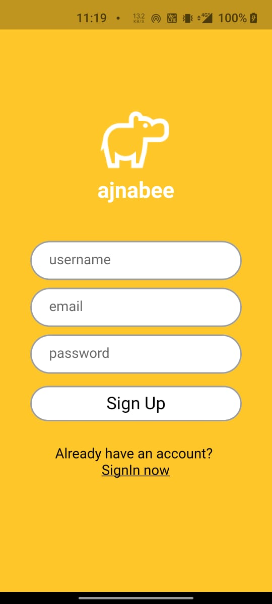
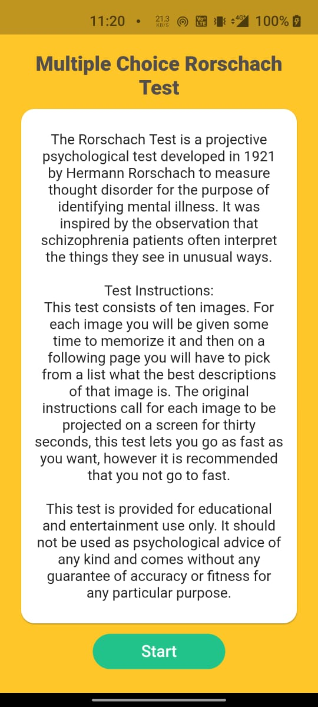
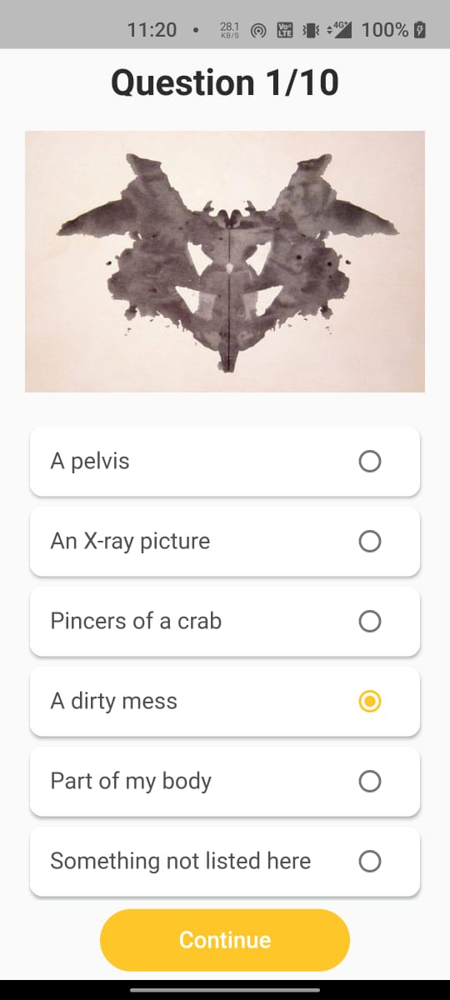
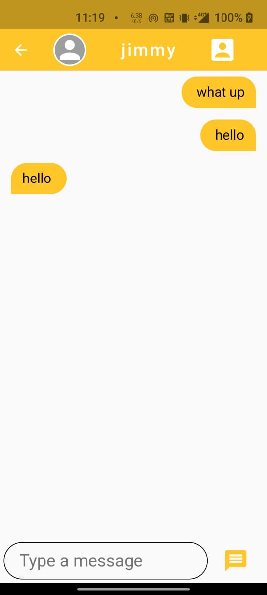

<h1 align="center">Ajnabee :hippopotamus:</h1>

   
  <h3> Meet people in a revolutionary way.</h3>

  

---
 - Link to the YouTube video is : https://youtu.be/Pe04W-8gwPc .
 
 

   

 
 
- ### Snapshots of the project :

  

  
  
  
  

---

### This is the repo for our mobile application Ajnabee 
#### The link to the repo of the server for our mobile application <a href="https://github.com/Hungry-Hippoos/Ajnabee">link :link:</a>
 
 ---

 #### Features to be added :
- Guide to help people start a conversation, keep a conversation alive, icebreakers.
- Video calling, voice calling features to be added.

---
#### This project was built under 24 hours

---
<h3 align="center"><b>Developed with :heart: by <a href="https://github.com/mrpandya">Manan Pandya</a>, <a href="https://github.com/tusharsarkar3">Tushar Sarkar</a>, <a href="https://github.com/dhairya903">Dhairya Shah</a>, <a href="https://github.com/sanjeetnaik">Sanjeet Naik</a>.</b></h1>
